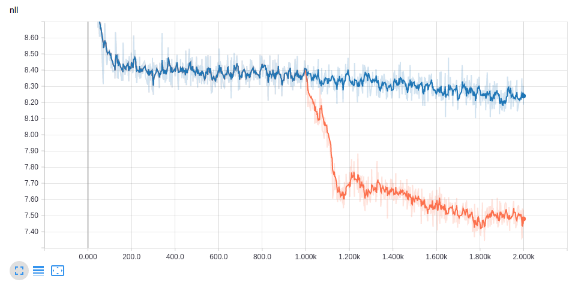

# SeqGAN in Tensorflow

As part of the implementation series of [Joseph Lim's group at USC](http://csail.mit.edu/~lim), our motivation is to accelerate (or sometimes delay) research in the AI community by promoting open-source projects. To this end, we implement state-of-the-art research papers, and publicly share them with concise reports. Please visit our [group github site](https://github.com/gitlimlab) for other projects.

This project is implemented by [Shaofan Lai](https://github.com/shaofanl) and reviewed by [Reviewer's name](Reviewer's url).

## Descriptions
This project includes a [[Tensorflow](https://github.com/tensorflow/tensorflow)] implementation of **SeqGAN** proposed in the paper [[SeqGAN: Sequence Generative Adversarial Nets with Policy Gradient](https://arxiv.org/abs/1609.05473)] by Lantao Yu et al. at Shanghai Jiao Tong University and University College London.

    

SeqGAN adapts GAN for sequential generation. It regards the generator as a policy in reinforcement learning and the discriminator is trained to provide the reward. To evaluate unfinished sequences, Monto-Carlo search is also applied to sample the complete sequences.

We use the advanced (decoder) APIs provided by the [tensorflow.contribs.seq2seq](https://www.tensorflow.org/tutorials/seq2seq) module to implement SeqGAN. Notice that it's extremly hard to select the hyper-parameters of SeqGAN as in GAN. And it is possible that the SeqGAN performs much more poorly than the supervised learning (MLE) method in other tasks if the hyper-parameters are randomly chosen. 

## Prerequisites

- Python 2.7
- [Tensorflow 1.4.1](https://developers.googleblog.com/2017/11/announcing-tensorflow-r14.html)
- pretty-midi (only for music dataset)

## Usage

### Datasets

- A randomly initialized LSTM is used to simulate a specific distribution.
- A music dataset contains multiple Nottingham Songs.

### Training

- Run `bash pure_pretrain.sh` to have a baseline that is trained with pure MLE loss for 2000 iterations.
- Run `bash pretrain_n_seqgan.sh` to train the mode with 1000 iterations of pretraining with MLE and another 1000 iterations with the loss SeqGAN proposed.

### Testing

- Run `tensorboard --logdir logs/eval/` and open your browser to check the improvement that SeqGAN provided.

## Results

    

After using SeqGAN's loss, the Negative Log Likelihood drops and converges to a smaller loss, which indicates that the generated sequences match the distribution of the randomly intialized LSTM better. 

[Show results here. It can includes training curves, training time, training accuracy, testing accuracy, generated images, etc.]

## Related works

[Yu, Lantao, et al. "SeqGAN: Sequence Generative Adversarial Nets with Policy Gradient." AAAI. 2017.](https://arxiv.org/abs/1609.05473)

## Author

Shaofan Lai / [@shaofanl](https://github.com/shaofanl/) @ [Joseph Lim's research lab](https://github.com/gitlimlab) @ USC
